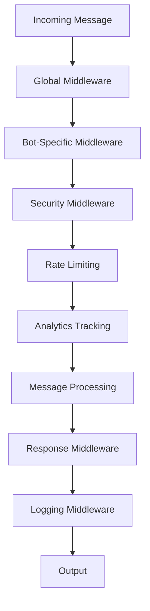

# 🔧 Middleware TegBot v2.0

## Обзор системы Middleware

TegBot v2.0 представляет революционную систему middleware для мультиботных экосистем:

- 🎯 **Bot-Specific Middleware**: Индивидуальные обработчики для каждого бота
- ⚡ **Pipeline Processing**: Последовательная обработка через цепочку middleware
- 🔄 **Before/After Hooks**: Выполнение кода до и после обработки сообщений
- 🛡️ **Security Middleware**: Встроенная защита и валидация
- 📊 **Analytics Middleware**: Автоматический сбор метрик
- 🎛️ **Conditional Middleware**: Динамическое применение по условиям

> ⚠️ **Важно**: v2.0 полностью переработал систему middleware. Миграция с v1.x обязательна.

## 🏗️ Архитектура Middleware

### Pipeline обработки



### Типы Middleware

1. **🌐 Global Middleware**
   - Применяется ко всем ботам
   - Базовая валидация и безопасность
   - Общие метрики и логирование

2. **🎯 Bot-Specific Middleware**
   - Уникальные для каждого бота
   - Специфическая бизнес-логика
   - Индивидуальные настройки

3. **🔐 Security Middleware**
   - Проверка прав доступа
   - Антиспам и rate limiting
   - Валидация входных данных

4. **📊 Analytics Middleware**
   - Сбор метрик и статистики
   - Трекинг пользователей
   - Мониторинг производительности

## 🎯 Создание Custom Middleware

### Базовый Middleware

```php
<?php
// app/TegBot/Middleware/CustomMiddleware.php
namespace App\TegBot\Middleware;

use Teg\LightBot;

class CustomMiddleware
{
    public function handle(LightBot $bot, \Closure $next)
    {
        // Логика ДО обработки сообщения
        $this->beforeProcessing($bot);
        
        // Продолжаем выполнение pipeline
        $response = $next($bot);
        
        // Логика ПОСЛЕ обработки сообщения
        $this->afterProcessing($bot, $response);
        
        return $response;
    }
    
    private function beforeProcessing(LightBot $bot): void
    {
        // Ваша логика "до"
        logger()->info('Processing message', [
            'bot' => $bot->getBotName(),
            'user_id' => $bot->getUserId,
            'message_id' => $bot->getMessageId
        ]);
    }
    
    private function afterProcessing(LightBot $bot, $response): void
    {
        // Ваша логика "после"
        logger()->info('Message processed', [
            'bot' => $bot->getBotName(),
            'response_time' => microtime(true) - LARAVEL_START
        ]);
    }
}
```

### Условный Middleware

```php
<?php
// app/TegBot/Middleware/ConditionalMiddleware.php
namespace App\TegBot\Middleware;

use Teg\LightBot;

class ConditionalMiddleware
{
    public function handle(LightBot $bot, \Closure $next)
    {
        // Применяем middleware только при определенных условиях
        if ($this->shouldApply($bot)) {
            $this->executeLogic($bot);
        }
        
        return $next($bot);
    }
    
    private function shouldApply(LightBot $bot): bool
    {
        // Условия применения
        return $bot->isGroup() && 
               $bot->hasText() && 
               $bot->getUserRole() === 'admin';
    }
    
    private function executeLogic(LightBot $bot): void
    {
        // Специфическая логика для админов в группах
        $bot->logAdminAction($bot->getMessageText);
    }
}
```

### Параметризованный Middleware

```php
<?php
// app/TegBot/Middleware/ParameterizedMiddleware.php
namespace App\TegBot\Middleware;

use Teg\LightBot;

class ParameterizedMiddleware
{
    private string $permission;
    private array $options;
    
    public function __construct(string $permission, array $options = [])
    {
        $this->permission = $permission;
        $this->options = $options;
    }
    
    public function handle(LightBot $bot, \Closure $next)
    {
        if (!$this->checkPermission($bot)) {
            $this->denyAccess($bot);
            return false; // Прерываем выполнение
        }
        
        return $next($bot);
    }
    
    private function checkPermission(LightBot $bot): bool
    {
        return $bot->userHasPermission($this->permission);
    }
    
    private function denyAccess(LightBot $bot): void
    {
        $message = $this->options['deny_message'] ?? 
                   "❌ Недостаточно прав для выполнения действия";
        
        $bot->sendMessage($bot->getChatId, $message);
    }
}
```

## 🔗 Регистрация Middleware

### Глобальный Middleware

```php
<?php
// app/TegBot/Kernel.php
namespace App\TegBot;

class Kernel
{
    protected array $globalMiddleware = [
        \App\TegBot\Middleware\SecurityMiddleware::class,
        \App\TegBot\Middleware\RateLimitingMiddleware::class,
        \App\TegBot\Middleware\AnalyticsMiddleware::class,
        \App\TegBot\Middleware\LoggingMiddleware::class,
    ];
    
    protected array $middlewareAliases = [
        'auth' => \App\TegBot\Middleware\AuthMiddleware::class,
        'admin' => \App\TegBot\Middleware\AdminMiddleware::class,
        'throttle' => \App\TegBot\Middleware\ThrottleMiddleware::class,
        'validate' => \App\TegBot\Middleware\ValidationMiddleware::class,
    ];
}
```

### Bot-Specific Middleware

```php
<?php
// app/Bots/ShopBot.php
namespace App\Bots;

use Teg\LightBot;

class ShopBot extends LightBot
{
    protected array $middleware = [
        'auth',                    // Alias
        'throttle:60,1',          // С параметрами
        \App\TegBot\Middleware\ShopSecurityMiddleware::class,
    ];
    
    protected array $middlewareGroups = [
        'api' => [
            'throttle:60,1',
            'validate:strict',
        ],
        'admin' => [
            'auth',
            'admin',
            \App\TegBot\Middleware\AuditMiddleware::class,
        ],
    ];
    
    public function main(): void
    {
        // Применяем middleware для конкретных действий
        $this->middleware(['admin'])->when(function () {
            return $this->isAdminCommand();
        });
        
        $this->commands();
        $this->handleMessage();
    }
}
```

### Middleware для команд

```php
<?php
// Применение middleware к отдельным командам
class AdvancedBot extends LightBot
{
    public function commands(): void
    {
        // Middleware для одной команды
        $this->registerCommand('admin_panel', function () {
            $this->showAdminPanel();
        }, [
            'middleware' => ['auth', 'admin'],
            'description' => 'Административная панель'
        ]);
        
        // Middleware с параметрами
        $this->registerCommand('upload', function ($args) {
            $this->handleUpload($args);
        }, [
            'middleware' => [
                'auth',
                'throttle:5,60',  // 5 запросов в минуту
                'validate:file'
            ],
            'description' => 'Загрузка файлов'
        ]);
        
        // Условный middleware
        $this->registerCommand('moderate', function ($args) {
            $this->moderateContent($args);
        }, [
            'middleware' => function ($bot) {
                return $bot->isGroup() ? ['auth', 'moderator'] : ['auth'];
            },
            'description' => 'Модерация контента'
        ]);
    }
}
```

## 🛡️ Security Middleware

### Аутентификация

```php
<?php
// app/TegBot/Middleware/AuthMiddleware.php
namespace App\TegBot\Middleware;

use Teg\LightBot;
use App\Models\UserPermission;

class AuthMiddleware
{
    public function handle(LightBot $bot, \Closure $next)
    {
        $userId = $bot->getUserId;
        $botName = $bot->getBotName();
        
        // Проверяем права пользователя
        $permission = UserPermission::where('user_id', $userId)
            ->where('bot_name', $botName)
            ->where(function ($query) {
                $query->whereNull('expires_at')
                      ->orWhere('expires_at', '>', now());
            })
            ->first();
        
        if (!$permission) {
            $this->unauthorizedResponse($bot);
            return false;
        }
        
        // Сохраняем права в контексте бота
        $bot->setUserPermissions($permission->permissions);
        
        return $next($bot);
    }
    
    private function unauthorizedResponse(LightBot $bot): void
    {
        $bot->sendMessage($bot->getChatId, 
            "🔐 Для использования бота необходима авторизация.\n" .
            "Обратитесь к администратору для получения доступа."
        );
    }
}
```

### Rate Limiting

```php
<?php
// app/TegBot/Middleware/RateLimitingMiddleware.php
namespace App\TegBot\Middleware;

use Teg\LightBot;
use Illuminate\Support\Facades\Cache;

class RateLimitingMiddleware
{
    private int $maxAttempts;
    private int $decayMinutes;
    
    public function __construct(int $maxAttempts = 60, int $decayMinutes = 1)
    {
        $this->maxAttempts = $maxAttempts;
        $this->decayMinutes = $decayMinutes;
    }
    
    public function handle(LightBot $bot, \Closure $next)
    {
        $key = $this->resolveRequestSignature($bot);
        $attempts = Cache::get($key, 0);
        
        if ($attempts >= $this->maxAttempts) {
            $this->rateLimitExceeded($bot);
            return false;
        }
        
        Cache::put($key, $attempts + 1, now()->addMinutes($this->decayMinutes));
        
        return $next($bot);
    }
    
    private function resolveRequestSignature(LightBot $bot): string
    {
        return 'rate_limit:' . $bot->getBotName() . ':' . $bot->getUserId;
    }
    
    private function rateLimitExceeded(LightBot $bot): void
    {
        $bot->sendMessage($bot->getChatId, 
            "⏱️ Слишком много запросов. Попробуйте позже."
        );
        
        // Логируем превышение лимита
        logger()->warning('Rate limit exceeded', [
            'bot' => $bot->getBotName(),
            'user_id' => $bot->getUserId,
            'chat_id' => $bot->getChatId
        ]);
    }
}
```

### Антиспам

```php
<?php
// app/TegBot/Middleware/AntiSpamMiddleware.php
namespace App\TegBot\Middleware;

use Teg\LightBot;
use Illuminate\Support\Facades\Cache;

class AntiSpamMiddleware
{
    public function handle(LightBot $bot, \Closure $next)
    {
        if (!$bot->hasText()) {
            return $next($bot);
        }
        
        $messageText = $bot->getMessageText;
        $userId = $bot->getUserId;
        
        // Проверка на дублированные сообщения
        if ($this->isDuplicateMessage($messageText, $userId)) {
            $this->spamDetected($bot, 'duplicate_message');
            return false;
        }
        
        // Проверка на спам-слова
        if ($this->containsSpam($messageText)) {
            $this->spamDetected($bot, 'spam_words');
            return false;
        }
        
        // Проверка частоты сообщений
        if ($this->isHighFrequency($userId)) {
            $this->spamDetected($bot, 'high_frequency');
            return false;
        }
        
        return $next($bot);
    }
    
    private function isDuplicateMessage(string $message, int $userId): bool
    {
        $hash = hash('sha256', $message);
        $key = "message_hash:{$userId}:{$hash}";
        
        if (Cache::has($key)) {
            return true;
        }
        
        Cache::put($key, true, 300); // 5 минут
        return false;
    }
    
    private function containsSpam(string $message): bool
    {
        $spamWords = ['spam', 'scam', 'fake', 'фейк', 'развод'];
        $message = mb_strtolower($message);
        
        foreach ($spamWords as $spamWord) {
            if (str_contains($message, $spamWord)) {
                return true;
            }
        }
        
        return false;
    }
    
    private function isHighFrequency(int $userId): bool
    {
        $key = "message_frequency:{$userId}";
        $count = Cache::get($key, 0);
        
        if ($count > 10) { // Более 10 сообщений в минуту
            return true;
        }
        
        Cache::put($key, $count + 1, 60);
        return false;
    }
    
    private function spamDetected(LightBot $bot, string $reason): void
    {
        $bot->sendMessage($bot->getChatId, 
            "🚫 Сообщение заблокировано системой антиспама"
        );
        
        // Логируем обнаружение спама
        logger()->warning('Spam detected', [
            'bot' => $bot->getBotName(),
            'user_id' => $bot->getUserId,
            'reason' => $reason,
            'message' => $bot->getMessageText ?? 'N/A'
        ]);
    }
}
```

## 📊 Analytics Middleware

### Трекинг пользователей

```php
<?php
// app/TegBot/Middleware/UserTrackingMiddleware.php
namespace App\TegBot\Middleware;

use Teg\LightBot;
use App\Models\UserActivity;

class UserTrackingMiddleware
{
    public function handle(LightBot $bot, \Closure $next)
    {
        $this->trackUserActivity($bot);
        
        $startTime = microtime(true);
        $response = $next($bot);
        $endTime = microtime(true);
        
        $this->trackResponseTime($bot, $endTime - $startTime);
        
        return $response;
    }
    
    private function trackUserActivity(LightBot $bot): void
    {
        UserActivity::create([
            'user_id' => $bot->getUserId,
            'bot_name' => $bot->getBotName(),
            'action' => $this->getActionType($bot),
            'data' => $this->getActionData($bot),
            'timestamp' => now()
        ]);
    }
    
    private function getActionType(LightBot $bot): string
    {
        if ($bot->hasCommand()) {
            return 'command';
        } elseif ($bot->hasCallbackQuery()) {
            return 'callback';
        } elseif ($bot->hasText()) {
            return 'message';
        } else {
            return 'other';
        }
    }
    
    private function getActionData(LightBot $bot): array
    {
        return [
            'command' => $bot->getCommand() ?? null,
            'text' => mb_substr($bot->getMessageText ?? '', 0, 100),
            'callback_data' => $bot->getCallbackData ?? null,
            'chat_type' => $bot->getChatType(),
            'message_id' => $bot->getMessageId
        ];
    }
    
    private function trackResponseTime(LightBot $bot, float $responseTime): void
    {
        if ($responseTime > 1.0) { // Логируем медленные ответы
            logger()->warning('Slow response detected', [
                'bot' => $bot->getBotName(),
                'user_id' => $bot->getUserId,
                'response_time' => $responseTime
            ]);
        }
        
        // Отправляем метрику в аналитику
        $this->sendMetric('response_time', $responseTime, [
            'bot' => $bot->getBotName(),
            'action' => $this->getActionType($bot)
        ]);
    }
}
```

### Метрики производительности

```php
<?php
// app/TegBot/Middleware/PerformanceMiddleware.php
namespace App\TegBot\Middleware;

use Teg\LightBot;

class PerformanceMiddleware
{
    public function handle(LightBot $bot, \Closure $next)
    {
        $metrics = [
            'memory_start' => memory_get_usage(true),
            'time_start' => microtime(true)
        ];
        
        $response = $next($bot);
        
        $metrics['memory_end'] = memory_get_usage(true);
        $metrics['time_end'] = microtime(true);
        $metrics['memory_peak'] = memory_get_peak_usage(true);
        
        $this->recordMetrics($bot, $metrics);
        
        return $response;
    }
    
    private function recordMetrics(LightBot $bot, array $metrics): void
    {
        $duration = $metrics['time_end'] - $metrics['time_start'];
        $memoryUsed = $metrics['memory_end'] - $metrics['memory_start'];
        
        // Отправляем в систему мониторинга
        $this->sendTelemetry([
            'bot_name' => $bot->getBotName(),
            'duration_ms' => round($duration * 1000, 2),
            'memory_used_mb' => round($memoryUsed / 1024 / 1024, 2),
            'memory_peak_mb' => round($metrics['memory_peak'] / 1024 / 1024, 2),
            'action_type' => $this->getActionType($bot),
            'timestamp' => now()
        ]);
        
        // Предупреждение о высоком потреблении ресурсов
        if ($duration > 5.0 || $memoryUsed > 50 * 1024 * 1024) {
            logger()->warning('High resource usage detected', [
                'bot' => $bot->getBotName(),
                'duration' => $duration,
                'memory_used' => $memoryUsed
            ]);
        }
    }
}
```

## 🔄 Conditional Middleware

### Динамическое применение

```php
<?php
// app/Bots/SmartBot.php
namespace App\Bots;

use Teg\LightBot;

class SmartBot extends LightBot
{
    public function main(): void
    {
        // Применяем middleware в зависимости от условий
        $this->applyConditionalMiddleware();
        
        $this->commands();
        $this->handleMessage();
    }
    
    private function applyConditionalMiddleware(): void
    {
        // Для новых пользователей
        $this->middleware(['onboarding'])->when(function () {
            return $this->isNewUser();
        });
        
        // Для групповых чатов
        $this->middleware(['group_rules', 'moderation'])->when(function () {
            return $this->isGroup();
        });
        
        // В рабочее время
        $this->middleware(['business_hours'])->when(function () {
            return $this->isBusinessHours();
        });
        
        // Для премиум пользователей
        $this->middleware(['premium_features'])->when(function () {
            return $this->isPremiumUser();
        });
        
        // По дням недели
        $this->middleware(['weekend_mode'])->when(function () {
            return now()->isWeekend();
        });
    }
    
    private function isNewUser(): bool
    {
        return !UserActivity::where('user_id', $this->getUserId)
            ->where('bot_name', $this->getBotName())
            ->exists();
    }
    
    private function isBusinessHours(): bool
    {
        $hour = now()->hour;
        return $hour >= 9 && $hour <= 18 && !now()->isWeekend();
    }
    
    private function isPremiumUser(): bool
    {
        return $this->getUserPermissions()['premium'] ?? false;
    }
}
```

### Middleware Groups

```php
<?php
// app/TegBot/Kernel.php
namespace App\TegBot;

class Kernel
{
    protected array $middlewareGroups = [
        'basic' => [
            'security',
            'rate_limit',
            'analytics'
        ],
        
        'premium' => [
            'security',
            'rate_limit:premium',
            'analytics',
            'premium_features',
            'priority_support'
        ],
        
        'admin' => [
            'security',
            'auth:admin',
            'audit',
            'no_rate_limit',
            'analytics'
        ],
        
        'api' => [
            'cors',
            'rate_limit:api',
            'api_auth',
            'json_response'
        ],
        
        'development' => [
            'security:relaxed',
            'debug',
            'performance_profiling'
        ]
    ];
}

// Использование в боте
class EcommerceBot extends LightBot
{
    public function main(): void
    {
        // Применяем группу middleware в зависимости от окружения
        $group = app()->environment('production') ? 'premium' : 'development';
        $this->middleware($group);
        
        $this->handleRequest();
    }
}
```

## 🔧 Продвинутые паттерны

### Pipeline Middleware

```php
<?php
// app/TegBot/Middleware/PipelineMiddleware.php
namespace App\TegBot\Middleware;

use Teg\LightBot;

class PipelineMiddleware
{
    private array $stages;
    
    public function __construct(array $stages)
    {
        $this->stages = $stages;
    }
    
    public function handle(LightBot $bot, \Closure $next)
    {
        $pipeline = array_reduce(
            array_reverse($this->stages),
            $this->carry(),
            function ($bot) use ($next) {
                return $next($bot);
            }
        );
        
        return $pipeline($bot);
    }
    
    private function carry(): \Closure
    {
        return function ($stack, $stage) {
            return function ($bot) use ($stack, $stage) {
                return (new $stage)->handle($bot, $stack);
            };
        };
    }
}

// Использование
$this->middleware([
    new PipelineMiddleware([
        ValidateInputMiddleware::class,
        SanitizeDataMiddleware::class,
        CheckPermissionsMiddleware::class,
        LogActivityMiddleware::class,
    ])
]);
```

### Caching Middleware

```php
<?php
// app/TegBot/Middleware/CachingMiddleware.php
namespace App\TegBot\Middleware;

use Teg\LightBot;
use Illuminate\Support\Facades\Cache;

class CachingMiddleware
{
    private int $ttl;
    
    public function __construct(int $ttl = 3600)
    {
        $this->ttl = $ttl;
    }
    
    public function handle(LightBot $bot, \Closure $next)
    {
        $cacheKey = $this->generateCacheKey($bot);
        
        // Пробуем получить из кэша
        if (Cache::has($cacheKey)) {
            $cachedResponse = Cache::get($cacheKey);
            $this->sendCachedResponse($bot, $cachedResponse);
            return $cachedResponse;
        }
        
        // Выполняем обработку
        $response = $next($bot);
        
        // Сохраняем в кэш если это кэшируемый ответ
        if ($this->shouldCache($bot, $response)) {
            Cache::put($cacheKey, $response, $this->ttl);
        }
        
        return $response;
    }
    
    private function generateCacheKey(LightBot $bot): string
    {
        return sprintf(
            'bot_response:%s:%s:%s',
            $bot->getBotName(),
            $bot->getUserId,
            hash('sha256', $bot->getMessageText ?? $bot->getCallbackData ?? '')
        );
    }
    
    private function shouldCache(LightBot $bot, $response): bool
    {
        // Кэшируем только определенные типы ответов
        return $bot->hasCommand() && 
               !$bot->isAdminCommand() && 
               $response !== false;
    }
}
```

## 🔧 Управление Middleware через CLI

### Команды управления

```bash
# Просмотр зарегистрированных middleware
php artisan teg:middleware list
php artisan teg:middleware list --bot=shop_bot

# Включение/отключение middleware
php artisan teg:middleware enable shop_bot auth
php artisan teg:middleware disable shop_bot rate_limit

# Настройка параметров middleware
php artisan teg:middleware config shop_bot throttle --max=100 --window=60

# Тестирование middleware
php artisan teg:middleware test shop_bot auth --user=123456789

# Создание нового middleware
php artisan make:tegbot-middleware CustomMiddleware
php artisan make:tegbot-middleware CustomMiddleware --security

# Анализ производительности middleware
php artisan teg:middleware performance
php artisan teg:middleware performance --bot=shop_bot
```

### Конфигурация middleware через настройки

```bash
# Настройка middleware для бота
php artisan teg:bot config shop_bot --set middleware.global="security,rate_limit,analytics"
php artisan teg:bot config shop_bot --set middleware.admin="auth:admin,audit"
php artisan teg:bot config shop_bot --set middleware.api="cors,throttle:api"

# Параметры middleware
php artisan teg:bot config shop_bot --set middleware.params.rate_limit.max=120
php artisan teg:bot config shop_bot --set middleware.params.auth.timeout=3600

# Условия применения
php artisan teg:bot config shop_bot --set middleware.conditions.premium="user.type=premium"
php artisan teg:bot config shop_bot --set middleware.conditions.business_hours="time.hour>=9,time.hour<=18"
```

## 📊 Мониторинг и отладка

### Middleware Profiler

```php
<?php
// app/TegBot/Middleware/ProfilerMiddleware.php
namespace App\TegBot\Middleware;

use Teg\LightBot;

class ProfilerMiddleware
{
    public function handle(LightBot $bot, \Closure $next)
    {
        if (!config('app.debug')) {
            return $next($bot);
        }
        
        $profiler = new MiddlewareProfiler();
        $profiler->start($bot);
        
        $response = $next($bot);
        
        $profiler->end($bot, $response);
        $profiler->sendReport();
        
        return $response;
    }
}

class MiddlewareProfiler
{
    private array $timeline = [];
    
    public function start(LightBot $bot): void
    {
        $this->timeline[] = [
            'type' => 'start',
            'bot' => $bot->getBotName(),
            'user_id' => $bot->getUserId,
            'memory' => memory_get_usage(true),
            'time' => microtime(true)
        ];
    }
    
    public function end(LightBot $bot, $response): void
    {
        $this->timeline[] = [
            'type' => 'end',
            'bot' => $bot->getBotName(),
            'memory' => memory_get_usage(true),
            'time' => microtime(true),
            'response_type' => gettype($response)
        ];
    }
    
    public function sendReport(): void
    {
        $start = $this->timeline[0];
        $end = end($this->timeline);
        
        $report = [
            'duration_ms' => round(($end['time'] - $start['time']) * 1000, 2),
            'memory_used_mb' => round(($end['memory'] - $start['memory']) / 1024 / 1024, 2),
            'bot' => $start['bot'],
            'user_id' => $start['user_id']
        ];
        
        logger()->debug('Middleware execution report', $report);
    }
}
```

### Debugging команды

```bash
# Трассировка выполнения middleware
php artisan teg:middleware trace shop_bot --user=123456789 --message="/start"

# Просмотр логов middleware
php artisan teg:middleware logs shop_bot --tail --filter=error

# Статистика выполнения
php artisan teg:middleware stats --period=1h --breakdown=bot

# Проверка конфигурации
php artisan teg:middleware validate shop_bot
```

## 📚 Best Practices

### 🎯 Проектирование Middleware
1. **Принцип единственной ответственности**: Один middleware = одна задача
2. **Композиция**: Объединяйте простые middleware в сложные pipelines
3. **Переиспользование**: Создавайте универсальные middleware для всех ботов
4. **Производительность**: Избегайте тяжелых операций в middleware

### 🔧 Порядок выполнения
1. **Global middleware**: Базовая безопасность и валидация
2. **Bot-specific middleware**: Специфическая логика бота
3. **Command middleware**: Middleware для конкретных команд
4. **Response middleware**: Обработка ответов

### 🛡️ Безопасность
1. **Проверка входных данных**: Всегда валидируйте входящие сообщения
2. **Rate limiting**: Защита от спама и DDoS
3. **Аудит**: Логирование всех критических действий
4. **Graceful degradation**: Корректная обработка ошибок

### 📊 Мониторинг
1. **Метрики производительности**: Отслеживайте время выполнения
2. **Использование ресурсов**: Мониторинг памяти и CPU
3. **Частота ошибок**: Алерты на аномалии
4. **Пользовательская активность**: Аналитика использования

---

🔧 **TegBot v2.0 Middleware** - Мощная и гибкая система обработки для ваших ботов! 