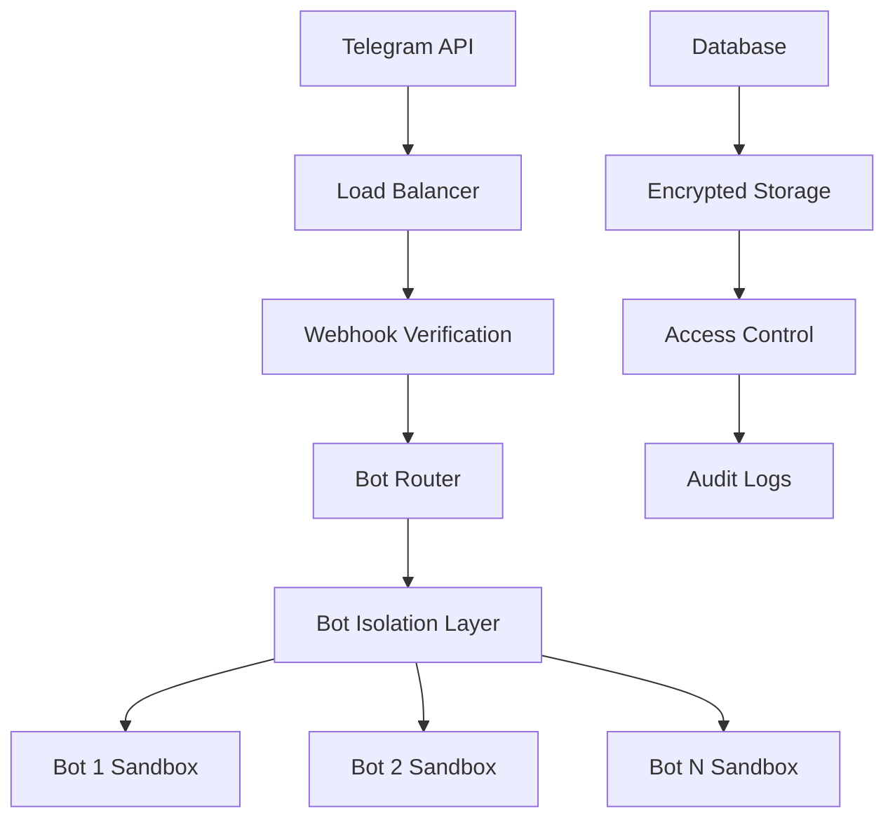

# 🔐 Безопасность TegBot v2.0

## Обзор безопасности

TegBot v2.0 внедряет революционную систему безопасности для мультиботных экосистем:

- 🛡️ **Изоляция ботов**: Каждый бот работает в своем безопасном окружении
- 🔑 **Индивидуальные токены**: Уникальные секреты для каждого бота
- 🌐 **Защищенные webhook'и**: Криптографическая проверка подписей
- 🎯 **Гранулярные права**: Точечное управление доступом
- 📊 **Аудит безопасности**: Полное логирование всех действий
- 🚨 **Мониторинг угроз**: Автоматическое обнаружение аномалий

> ⚠️ **Важно**: v2.0 НЕ совместим с v1.x в плане безопасности. Требуется полная миграция.

## 🏗️ Архитектура безопасности

### Многоуровневая защита



### Компоненты безопасности

1. **🌐 Webhook Security Layer**
   - Проверка подписей Telegram
   - Rate limiting
   - IP whitelisting
   - DDoS protection

2. **🎯 Bot Isolation**
   - Отдельные процессы
   - Изолированные конфигурации
   - Независимые права доступа
   - Sandbox environments

3. **🔐 Cryptographic Protection**
   - Шифрование токенов в БД
   - HMAC verification
   - Secure key rotation
   - Certificate management

## 🔑 Управление токенами и секретами

### Безопасное хранение в базе данных

```sql
-- Структура таблицы безопасности
CREATE TABLE tegbot_bots (
    id BIGINT PRIMARY KEY,
    name VARCHAR(255) UNIQUE NOT NULL,
    token_encrypted TEXT NOT NULL,        -- Зашифрованный токен
    webhook_secret VARCHAR(255),          -- Секрет webhook'а
    encryption_key VARCHAR(255),          -- Ключ шифрования
    last_key_rotation TIMESTAMP,          -- Последняя ротация ключей
    security_level ENUM('basic', 'standard', 'high', 'critical'),
    ip_whitelist JSON,                    -- Разрешенные IP
    rate_limits JSON,                     -- Лимиты запросов
    audit_enabled BOOLEAN DEFAULT true,
    created_at TIMESTAMP,
    updated_at TIMESTAMP
);
```

### Шифрование токенов

```php
// Автоматическое шифрование при сохранении
class Bot extends Model
{
    protected $fillable = ['name', 'token', 'settings'];
    
    // Шифрование токена
    public function setTokenAttribute($value): void
    {
        $this->attributes['token_encrypted'] = encrypt($value);
        $this->attributes['encryption_key'] = $this->generateEncryptionKey();
    }
    
    // Расшифровка токена
    public function getTokenAttribute(): string
    {
        return decrypt($this->attributes['token_encrypted']);
    }
    
    private function generateEncryptionKey(): string
    {
        return bin2hex(random_bytes(32));
    }
}
```

### Ротация ключей безопасности

```bash
# Автоматическая ротация ключей
php artisan teg:security rotate-keys
php artisan teg:security rotate-keys --bot=shop_bot
php artisan teg:security rotate-keys --all --force

# Проверка статуса ключей
php artisan teg:security key-status
php artisan teg:security key-status --bot=shop_bot

# Планировщик ротации
php artisan teg:security schedule-rotation --interval=30d
```

**Результат ротации:**
```
🔐 Ротация ключей безопасности:

✅ shop_bot:
   • Новый webhook secret: d4f2...a8b9
   • Ключ шифрования обновлен
   • Webhook переустановлен
   
✅ support_bot:
   • Новый webhook secret: 9c7a...f2d1
   • Ключ шифрования обновлен
   • Webhook переустановлен

📊 Общая статистика:
   • Ботов обновлено: 2
   • Время выполнения: 3.2 сек
   • Статус: Успешно
```

## 🌐 Безопасность Webhook'ов

### Верификация подписей

```php
// Middleware для проверки webhook'ов
class VerifyTelegramWebhook
{
    public function handle(Request $request, Closure $next)
    {
        $botName = $request->route('botName');
        $bot = Bot::where('name', $botName)->first();
        
        if (!$bot) {
            abort(404, 'Bot not found');
        }
        
        // Проверка подписи Telegram
        if (!$this->verifyTelegramSignature($request, $bot->webhook_secret)) {
            Log::warning('Invalid webhook signature', [
                'bot' => $botName,
                'ip' => $request->ip(),
                'headers' => $request->headers->all()
            ]);
            abort(403, 'Invalid signature');
        }
        
        // Проверка rate limiting
        if (!$this->checkRateLimit($request, $bot)) {
            abort(429, 'Rate limit exceeded');
        }
        
        return $next($request);
    }
    
    private function verifyTelegramSignature(Request $request, string $secret): bool
    {
        $signature = $request->header('X-Telegram-Bot-Api-Secret-Token');
        return hash_equals($secret, $signature);
    }
}
```

### Rate Limiting по ботам

```php
// Конфигурация лимитов в настройках бота
class Bot extends Model
{
    protected $casts = [
        'rate_limits' => 'array'
    ];
    
    public function getRateLimits(): array
    {
        return $this->rate_limits ?? [
            'requests_per_minute' => 30,
            'requests_per_hour' => 1000,
            'burst_limit' => 10
        ];
    }
}

// Применение лимитов
class TelegramRateLimiter
{
    public function checkLimit(string $botName, string $ip): bool
    {
        $bot = Bot::where('name', $botName)->first();
        $limits = $bot->getRateLimits();
        
        $key = "rate_limit:{$botName}:{$ip}";
        $current = Cache::get($key, 0);
        
        if ($current >= $limits['requests_per_minute']) {
            $this->logRateLimitExceeded($botName, $ip, $current);
            return false;
        }
        
        Cache::put($key, $current + 1, 60);
        return true;
    }
}
```

### IP Whitelisting

```bash
# Настройка разрешенных IP для бота
php artisan teg:security whitelist shop_bot --add=1.2.3.4
php artisan teg:security whitelist shop_bot --add=5.6.7.0/24
php artisan teg:security whitelist shop_bot --remove=1.2.3.4

# Просмотр whitelist
php artisan teg:security whitelist shop_bot --show

# Проверка IP
php artisan teg:security check-ip shop_bot 1.2.3.4
```

## 🎯 Управление правами доступа

### Система ролей и разрешений

```php
// Модель прав пользователей
class UserPermission extends Model
{
    protected $fillable = [
        'user_id', 'bot_name', 'role', 'permissions', 'granted_by', 'expires_at'
    ];
    
    protected $casts = [
        'permissions' => 'array',
        'expires_at' => 'datetime'
    ];
}

// Система ролей
class BotRole
{
    const OWNER = 'owner';           // Полные права
    const ADMIN = 'admin';           // Административные права
    const MODERATOR = 'moderator';   // Модерация контента
    const OPERATOR = 'operator';     // Базовые операции
    const USER = 'user';             // Обычный пользователь
    
    public static function getPermissions(string $role): array
    {
        return match($role) {
            self::OWNER => ['*'],
            self::ADMIN => [
                'bot.manage', 'users.manage', 'config.edit', 
                'analytics.view', 'security.manage'
            ],
            self::MODERATOR => [
                'messages.moderate', 'users.moderate', 
                'content.manage', 'reports.view'
            ],
            self::OPERATOR => [
                'messages.send', 'users.support', 
                'tickets.manage', 'basic.stats'
            ],
            self::USER => ['messages.receive', 'basic.interaction'],
            default => []
        };
    }
}
```

### Управление правами через CLI

```bash
# Назначение ролей
php artisan teg:permissions grant shop_bot 123456789 admin
php artisan teg:permissions grant shop_bot 987654321 moderator --expires="2024-12-31"

# Специфические разрешения
php artisan teg:permissions allow shop_bot 555666777 "analytics.view,config.edit"

# Отзыв прав
php artisan teg:permissions revoke shop_bot 123456789
php artisan teg:permissions revoke shop_bot 987654321 moderator

# Просмотр прав
php artisan teg:permissions list shop_bot
php artisan teg:permissions show shop_bot 123456789

# Массовые операции
php artisan teg:permissions bulk-grant shop_bot admin 111,222,333
php artisan teg:permissions cleanup-expired
```

### Проверка прав в боте

```php
class SecureBot extends LightBot
{
    protected function checkPermission(string $permission): bool
    {
        $userId = $this->getUserId;
        $botName = $this->getBotName();
        
        return UserPermission::where('user_id', $userId)
            ->where('bot_name', $botName)
            ->where(function ($query) use ($permission) {
                $query->whereJsonContains('permissions', $permission)
                      ->orWhereJsonContains('permissions', '*');
            })
            ->where(function ($query) {
                $query->whereNull('expires_at')
                      ->orWhere('expires_at', '>', now());
            })
            ->exists();
    }
    
    protected function requirePermission(string $permission): void
    {
        if (!$this->checkPermission($permission)) {
            $this->sendMessage($this->getChatId, 
                "❌ Недостаточно прав для выполнения этого действия");
            throw new UnauthorizedException("Permission denied: {$permission}");
        }
    }
    
    // Использование в командах
    public function commands(): void
    {
        $this->registerCommand('admin_panel', function () {
            $this->requirePermission('bot.manage');
            $this->showAdminPanel();
        });
        
        $this->registerCommand('ban_user', function ($args) {
            $this->requirePermission('users.moderate');
            $this->banUser((int)$args[0]);
        });
    }
}
```

## 🔍 Аудит и мониторинг безопасности

### Логирование всех действий

```php
// Централизованное логирование безопасности
class SecurityAuditLogger
{
    public static function logAction(string $action, array $context = []): void
    {
        $data = [
            'action' => $action,
            'user_id' => $context['user_id'] ?? null,
            'bot_name' => $context['bot_name'] ?? null,
            'ip_address' => request()->ip(),
            'user_agent' => request()->userAgent(),
            'timestamp' => now(),
            'context' => $context
        ];
        
        // Логируем в базу данных
        SecurityAuditLog::create($data);
        
        // Логируем в файл
        Log::channel('security')->info($action, $data);
        
        // Критические действия - отправляем алерты
        if (in_array($action, self::CRITICAL_ACTIONS)) {
            self::sendSecurityAlert($action, $data);
        }
    }
    
    const CRITICAL_ACTIONS = [
        'bot.created', 'bot.deleted', 'token.rotated',
        'admin.granted', 'security.breach', 'mass.operation'
    ];
}

// Использование в боте
class AuditableBot extends LightBot
{
    protected function executeCommand(string $command, array $args = []): void
    {
        SecurityAuditLogger::logAction('command.executed', [
            'command' => $command,
            'args' => $args,
            'user_id' => $this->getUserId,
            'bot_name' => $this->getBotName()
        ]);
        
        parent::executeCommand($command, $args);
    }
}
```

### Мониторинг аномалий

```php
// Детектор аномалий безопасности
class SecurityAnomalyDetector
{
    public function detectAnomalies(): array
    {
        $anomalies = [];
        
        // Подозрительная активность
        $anomalies = array_merge($anomalies, $this->detectSuspiciousActivity());
        
        // Массовые операции
        $anomalies = array_merge($anomalies, $this->detectMassOperations());
        
        // Необычные паттерны доступа
        $anomalies = array_merge($anomalies, $this->detectUnusualAccessPatterns());
        
        // Попытки взлома
        $anomalies = array_merge($anomalies, $this->detectBreachAttempts());
        
        return $anomalies;
    }
    
    private function detectSuspiciousActivity(): array
    {
        // Много неудачных команд от одного пользователя
        $suspicious = SecurityAuditLog::where('action', 'command.failed')
            ->where('created_at', '>=', now()->subHour())
            ->select('user_id', DB::raw('count(*) as attempts'))
            ->groupBy('user_id')
            ->having('attempts', '>', 10)
            ->get();
            
        return $suspicious->map(function ($item) {
            return [
                'type' => 'suspicious_activity',
                'severity' => 'medium',
                'description' => "User {$item->user_id} made {$item->attempts} failed commands in last hour",
                'user_id' => $item->user_id
            ];
        })->toArray();
    }
}
```

### Автоматические алерты безопасности

```bash
# Настройка системы алертов
php artisan teg:security alerts enable
php artisan teg:security alerts configure

# Типы алертов
php artisan teg:security alerts add failed_login --threshold=5 --window=10m
php artisan teg:security alerts add mass_commands --threshold=100 --window=1h
php artisan teg:security alerts add new_admin --immediate=true
php artisan teg:security alerts add token_access --immediate=true

# Каналы уведомлений
php artisan teg:security alerts channel telegram --bot=security_bot --chat=admin_chat
php artisan teg:security alerts channel email --to=admin@company.com
php artisan teg:security alerts channel slack --webhook=https://hooks.slack.com/...

# Тестирование алертов
php artisan teg:security alerts test
```

## 🛡️ Защита от атак

### DDoS Protection

```php
// Защита от DDoS на уровне webhook'ов
class DDoSProtectionMiddleware
{
    public function handle(Request $request, Closure $next)
    {
        $ip = $request->ip();
        $key = "ddos_protection:{$ip}";
        
        // Проверяем количество запросов за последние 5 минут
        $requests = Cache::get($key, 0);
        
        if ($requests > 300) { // Максимум 300 запросов за 5 минут
            Log::warning('DDoS attempt detected', [
                'ip' => $ip,
                'requests' => $requests,
                'user_agent' => $request->userAgent()
            ]);
            
            // Добавляем в черный список на 1 час
            Cache::put("blacklist:{$ip}", true, 3600);
            
            abort(429, 'Too Many Requests');
        }
        
        Cache::put($key, $requests + 1, 300);
        return $next($request);
    }
}
```

### Защита от спама

```php
// Антиспам система
class AntiSpamFilter
{
    public function isSpam(string $message, int $userId): bool
    {
        // Проверка на повторяющиеся сообщения
        if ($this->isDuplicateMessage($message, $userId)) {
            return true;
        }
        
        // Проверка частоты сообщений
        if ($this->isHighFrequency($userId)) {
            return true;
        }
        
        // Проверка на спам-слова
        if ($this->containsSpamWords($message)) {
            return true;
        }
        
        // ML-анализ текста
        if ($this->isSpamByML($message)) {
            return true;
        }
        
        return false;
    }
    
    private function isDuplicateMessage(string $message, int $userId): bool
    {
        $hash = hash('sha256', $message);
        $key = "message_hash:{$userId}:{$hash}";
        
        if (Cache::has($key)) {
            return true;
        }
        
        Cache::put($key, true, 300); // 5 минут
        return false;
    }
}
```

### Защита от инъекций

```php
// Санитизация входящих данных
class InputSanitizer
{
    public static function sanitizeMessage(string $message): string
    {
        // Удаляем потенциально опасные символы
        $message = preg_replace('/[<>"\']/', '', $message);
        
        // Ограничиваем длину
        $message = mb_substr($message, 0, 4096);
        
        // Фильтруем SQL инъекции
        $message = str_replace(['SELECT', 'INSERT', 'UPDATE', 'DELETE'], '', $message);
        
        return trim($message);
    }
    
    public static function sanitizeCallbackData(string $data): string
    {
        // Только разрешенные символы для callback_data
        return preg_replace('/[^a-zA-Z0-9_\-.]/', '', $data);
    }
}
```

## 🔧 Инструменты безопасности

### Security Scanner

```bash
# Полное сканирование безопасности
php artisan teg:security scan
php artisan teg:security scan --bot=shop_bot
php artisan teg:security scan --deep

# Проверка конкретных аспектов
php artisan teg:security scan:tokens      # Проверка токенов
php artisan teg:security scan:permissions # Проверка прав доступа
php artisan teg:security scan:webhooks    # Проверка webhook'ов
php artisan teg:security scan:encryption  # Проверка шифрования

# Генерация отчета безопасности
php artisan teg:security report
php artisan teg:security report --format=pdf
php artisan teg:security report --email=admin@company.com
```

**Пример отчета сканирования:**
```
🔍 Отчет сканирования безопасности TegBot v2.0

📊 Общая оценка: 95/100 (Отлично)

✅ Пройденные проверки:
   • Токены зашифрованы ✓
   • Webhook secrets уникальны ✓
   • Rate limiting настроен ✓
   • Аудит включен ✓
   • IP whitelisting активен ✓

⚠️  Рекомендации:
   • Ротация ключей просрочена для 1 бота
   • 2 пользователя имеют избыточные права
   • 1 бот не имеет IP ограничений

🛡️  Статистика угроз (за 24ч):
   • Заблокированных IP: 5
   • Отклоненных webhook'ов: 23
   • Попыток спама: 12
   • Аномалий обнаружено: 0
```

### Backup и Recovery

```bash
# Бэкап конфигурации безопасности
php artisan teg:security backup
php artisan teg:security backup --encrypt
php artisan teg:security backup --include-tokens

# Восстановление
php artisan teg:security restore backup_20240101.enc
php artisan teg:security restore --verify

# Аварийное восстановление
php artisan teg:security emergency-reset
php artisan teg:security emergency-reset --bot=compromised_bot
```

## 📚 Best Practices

### 🔐 Управление токенами
1. **Никогда не храните токены в коде или .env**
2. **Регулярно ротируйте ключи (рекомендуется ежемесячно)**
3. **Используйте разные уровни шифрования для разных ботов**
4. **Мониторьте доступ к токенам через аудит**

### 🌐 Безопасность webhook'ов
1. **Всегда проверяйте подписи Telegram**
2. **Используйте HTTPS для всех webhook'ов**
3. **Настройте rate limiting для каждого бота**
4. **Регулярно обновляйте webhook secrets**

### 👥 Управление пользователями
1. **Применяйте принцип минимальных привилегий**
2. **Устанавливайте сроки действия для временных прав**
3. **Регулярно аудируйте права пользователей**
4. **Используйте двухфакторную аутентификацию для админов**

### 📊 Мониторинг
1. **Включите аудит для всех критических операций**
2. **Настройте алерты на аномальную активность**
3. **Регулярно анализируйте логи безопасности**
4. **Создайте план реагирования на инциденты**

---

🛡️ **TegBot v2.0** - Корпоративный уровень безопасности для ваших Telegram ботов! 